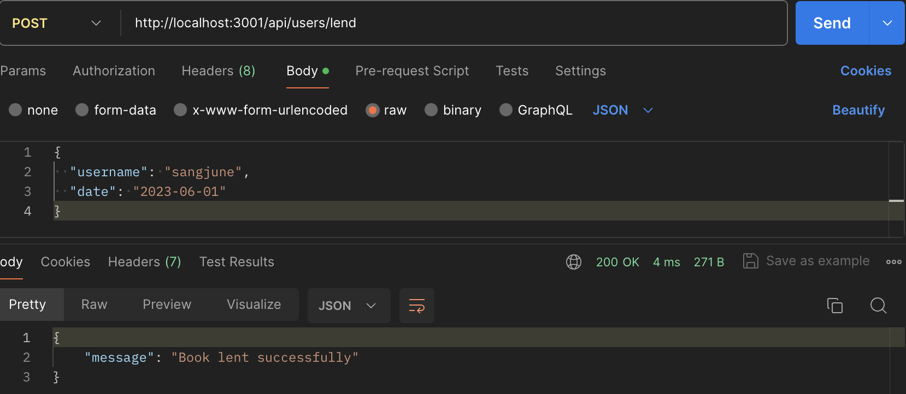
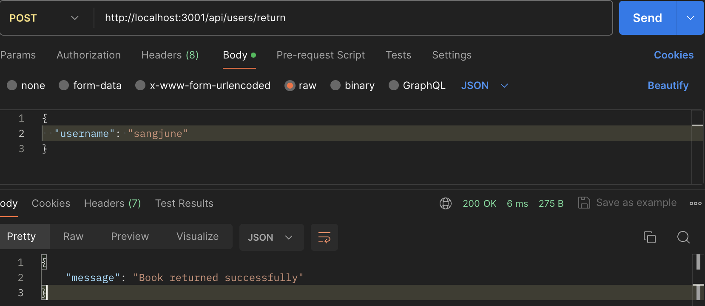
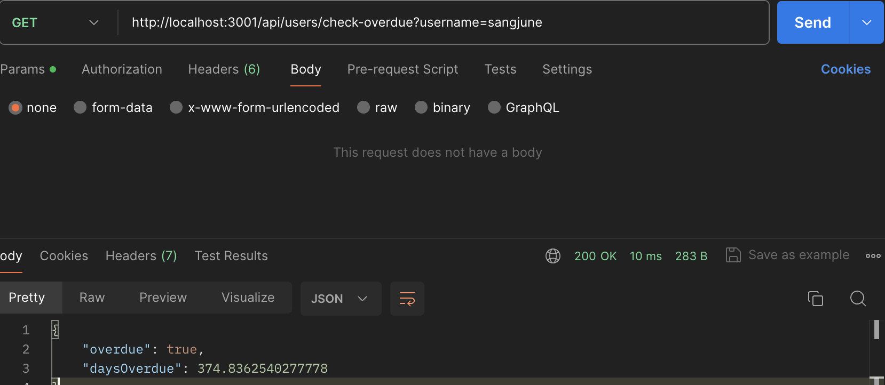
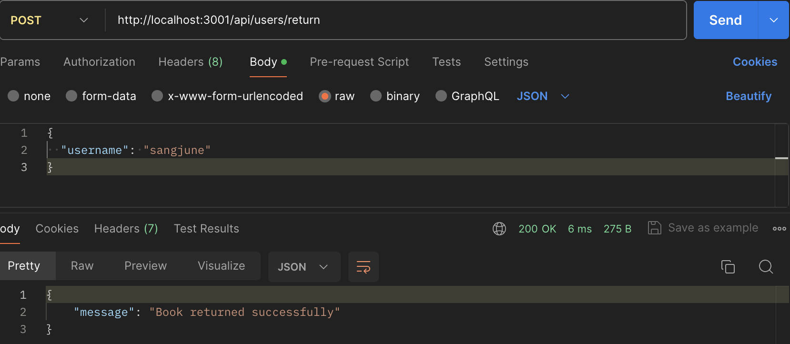
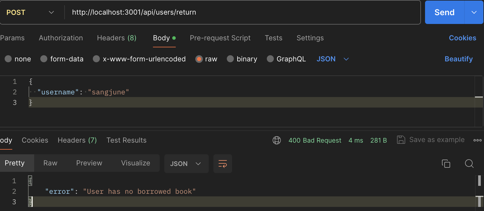
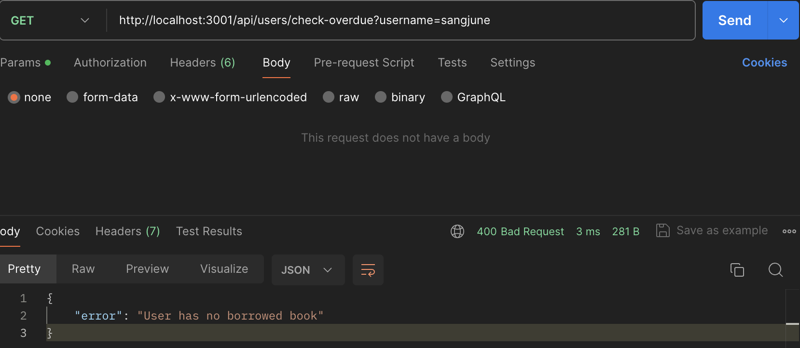
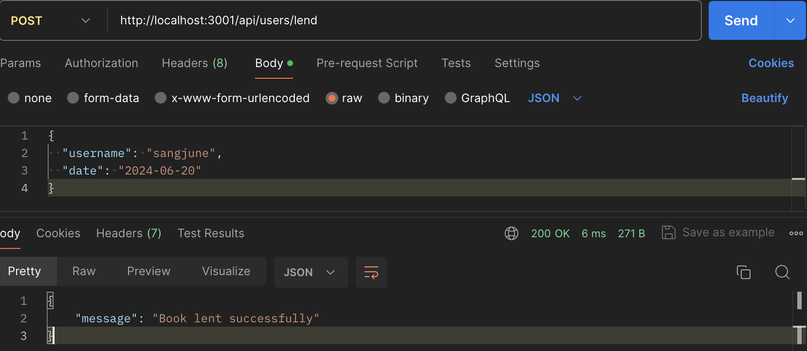
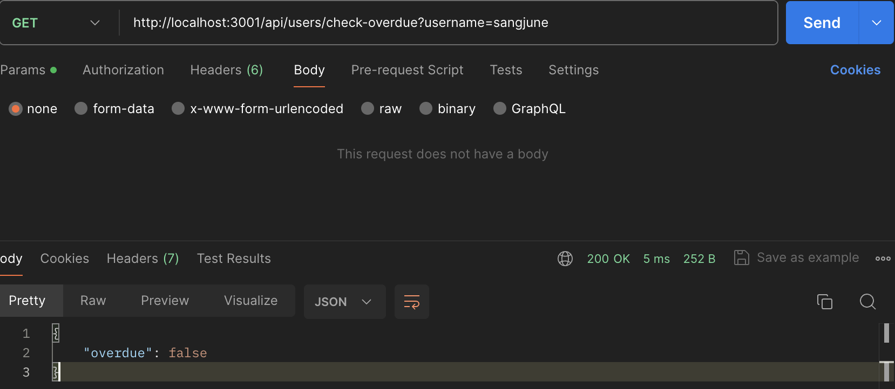

# Test 1 Readme.md

## Set up
1.  Clone the repository
2.  Run `npm install`to install dependencies
3.  Start the server with `node src/index.js`

Below are screen shots of Postman, testing endpoints

Lend a book testing

Return a book testing

Overdue testing

Return and sequences ( returned then return again, return then checks overdue)

return again

overdue checking after return

Lend and no overdue

overdue checks

console logs during testing:

(base) sangjunelee@SangjuncBookPro test1 % node src/index.js
Server is running on port 3001
GET /
OPTIONS /api/users/lend
OPTIONS /api/users/return
OPTIONS /api/users/lend
OPTIONS /api/users/lend
POST /api/users/lend
POST /api/users/lend
POST /api/users/lend
GET /api/users/check-overdue
GET /api/users/check-overdue
GET /api/users/check-overdue
GET /api/users/check-overdue
GET /api/users/check-overdue
GET /api/users/check-overdue
GET /api/users/check-overdue?username=navid%0A
GET /api/users/check-overdue%0A
POST /api/users/lend%0A
POST /api/users/lend
POST /api/users/lend
POST /api/users/return
POST /api/users/lend
GET /api/users/check-overdue?username=sangjune
POST /api/users/return
POST /api/users/return
GET /api/users/check-overdue?username=sangjune
POST /api/users/lend
GET /api/users/check-overdue?username=sangjune